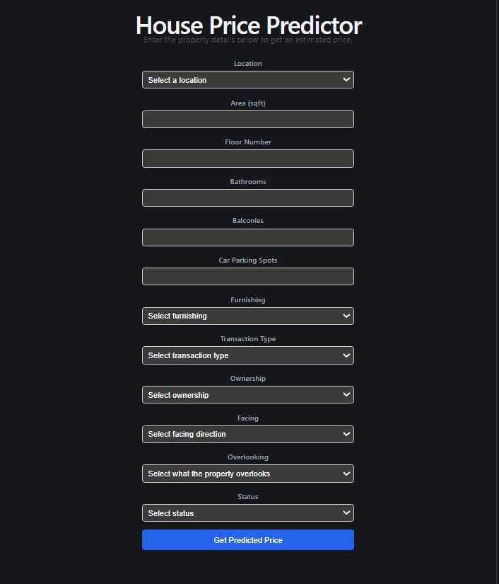
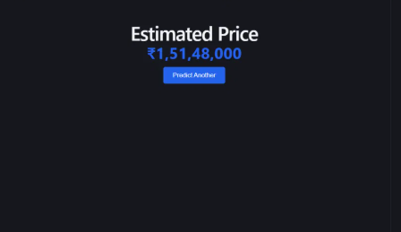

# House Price Prediction — End-to-End ML Web App

An end-to-end machine learning product that predicts Indian residential property prices.
It combines a data-cleaning + model-training notebook, a FastAPI backend that serves
predictions, and a React frontend where a user enters property details and sees an
estimated price.

## Overview

- **Data**: ~187,000 real property listings across India (Kaggle).
- **Model**: RandomForestRegressor trained inside a scikit-learn `Pipeline`
  (preprocessing + model bundled together), achieving **R² = 0.93** on the test set.
- **Backend**: FastAPI serving a single `/predict` endpoint, loading the trained
  pipeline once at startup.
- **Frontend**: React + TypeScript + Vite, with a form that posts to the backend and
  displays the predicted price.

## Architecture

```
┌─────────────────┐        HTTP (JSON)        ┌──────────────────┐        .predict()        ┌─────────────────────┐
│  React Frontend │  ────────────────────────▶ │  FastAPI Backend │  ─────────────────────▶ │  scikit-learn        │
│  (Vite, :5173)  │  ◀──────────────────────── │  (:8000)         │  ◀───────────────────── │  Pipeline (.pkl)      │
└─────────────────┘      predicted_price        └──────────────────┘         prediction       └─────────────────────┘
```

The user fills out a form on the frontend → the frontend sends a `POST /predict`
request with the property details → the backend turns that into a one-row DataFrame,
runs it through the trained pipeline (preprocessing + RandomForest, all bundled in one
`.pkl` file) → the predicted price is returned and displayed.

## Tech Stack

| Layer     | Technology |
|-----------|------------|
| Notebook  | Python, pandas, scikit-learn, matplotlib, seaborn, Jupyter |
| Backend   | FastAPI, Pydantic, uvicorn, joblib |
| Frontend  | React, TypeScript, Vite, react-router-dom |
| Model     | scikit-learn `Pipeline` (ColumnTransformer + RandomForestRegressor) |

## Project Structure

```
house-price-project/
├── notebooks/
│   ├── house_price_model.ipynb   # cleaning, EDA, training, evaluation, export
│   ├── locations.json            # allowed locations (frontend dropdown)
│   └── categories.json           # allowed categorical values (frontend dropdowns)
│
├── backend/
│   ├── app/
│   │   ├── main.py                    # FastAPI app, CORS, model loaded at startup
│   │   ├── api/routes/prediction.py   # GET /health, POST /predict
│   │   ├── core/config.py             # Settings from .env
│   │   ├── schemas/prediction.py      # PredictionRequest / PredictionResponse
│   │   └── services/
│   │       ├── preprocessing.py       # Turn a request into a one-row DataFrame
│   │       └── inference.py           # Load .pkl, run predict
│   ├── models/house_price.pkl         # trained model (NOT committed — see below)
│   ├── tests/test_prediction.py
│   ├── requirements.txt
│   ├── .env.example
│   └── Dockerfile
│
└── frontend/
    ├── src/
    │   ├── api/predictionClient.ts    # fetch wrapper, base URL from VITE_API_BASE_URL
    │   ├── components/PredictionForm.tsx
    │   ├── pages/HomePage.tsx | ResultPage.tsx | NotFoundPage.tsx
    │   ├── types/prediction.ts        # TS types mirroring the backend schema
    │   └── App.tsx                    # routes: / , /result , * (404)
    ├── public/locations.json
    ├── public/categories.json
    └── .env.example
```

## Full Setup (From Scratch)

Follow these steps in order. Each step links to more detail further down in this README
if you need it.

### 1. Install prerequisites

- Python 3.11+
- Node.js 18+ and npm
- Git
- A Kaggle account (free) — needed to download the dataset
- A GitHub account (free) — only needed if you plan to push your own changes

### 2. Clone this repository

```bash
git clone https://github.com/hamzahe06/house-price-app.git
cd house-price-app
```

### 3. Download the dataset

```bash
pip install kaggle
```

Get a Kaggle API token: Kaggle → your profile picture → **Settings** → **API** →
**Create New Token**. Save the resulting credentials to `~/.kaggle/` (see Kaggle's own
instructions shown at token creation — the exact steps can vary slightly by Kaggle's
current UI).

Then download the dataset directly into this project:

```bash
kaggle datasets download -d juhibhojani/house-price -p notebooks/data --unzip
```

You should end up with `notebooks/data/house_prices.csv` (~106MB).

### 4. Train the model

```bash
cd notebooks
python -m venv .venv
.venv\Scripts\activate        # Windows
# source .venv/bin/activate   # macOS / Linux

pip install jupyter pandas numpy scikit-learn matplotlib seaborn

jupyter notebook
```

Open `house_price_model.ipynb` in the browser tab that opens, then **Kernel → Restart &
Run All**. This will take a few minutes (training a RandomForest on ~180k rows). When it
finishes, you'll have `house_price.pkl`, `locations.json`, and `categories.json` sitting
in the `notebooks/` folder.

### 5. Set up and run the backend

```bash
cd ../backend
python -m venv .venv
.venv\Scripts\activate        # Windows
# source .venv/bin/activate   # macOS / Linux

pip install -r requirements.txt

copy .env.example .env        # Windows
# cp .env.example .env        # macOS / Linux

copy ..\notebooks\house_price.pkl models\house_price.pkl     # Windows
# cp ../notebooks/house_price.pkl models/house_price.pkl     # macOS / Linux
copy ..\notebooks\locations.json .                           # Windows
# cp ../notebooks/locations.json .                           # macOS / Linux
copy ..\notebooks\categories.json .                          # Windows
# cp ../notebooks/categories.json .                           # macOS / Linux

uvicorn app.main:app --reload
```

Leave this running. Confirm it works by visiting `http://localhost:8000/docs` and trying
`POST /predict`.

### 6. Set up and run the frontend

Open a **new** terminal (leave the backend running):

```bash
cd house-price-app/frontend
npm install

copy .env.example .env        # Windows
# cp .env.example .env        # macOS / Linux

copy ..\notebooks\locations.json public\      # Windows
# cp ../notebooks/locations.json public/      # macOS / Linux
copy ..\notebooks\categories.json public\     # Windows
# cp ../notebooks/categories.json public/     # macOS / Linux

npm run dev
```

### 7. Try it out

Open `http://localhost:5173`, fill out the form, and submit. You should see a predicted
price on the result page.

---

The sections below go into more detail on each part, for reference.

## Dataset

**House Price** by Juhi Bhojani — https://www.kaggle.com/datasets/juhibhojani/house-price

Real property listings from India (~187,000 rows), including columns such as `Amount(in rupees)`,
`location`, `Carpet Area`, `Super Area`, `Floor`, `Furnishing`, `Bathroom`, `Balcony`,
`Car Parking`, `Ownership`, `facing`, `overlooking`, `Status`, and more.

The raw CSV is **not committed** to this repository (it's ~106MB) — see step 3 of
**Full Setup** above for how to download it.

## Model

The trained model (`backend/models/house_price.pkl`, ~837MB) is **not committed** to this
repository — GitHub isn't well suited for files this large. See step 4 of **Full Setup**
above to regenerate it yourself, or request the pre-trained file from the repository
owner directly.

### Model Metrics (test set)

| Model | MAE (₹) | RMSE (₹) | R² |
|---|---|---|---|
| LinearRegression (baseline) | 4,098,243 | 6,700,983 | 0.6912 |
| **RandomForestRegressor (chosen)** | **921,675** | **3,173,866** | **0.9307** |

RandomForest was selected as the final model — it outperforms the linear baseline on
every metric, since the relationship between property features and price is clearly
non-linear (confirmed in the notebook's EDA).

## Backend Reference

See step 5 of **Full Setup** above to run it. Once running, the API is at
`http://localhost:8000`, with interactive docs (Swagger UI) at `http://localhost:8000/docs`.

### Environment Variables (backend/.env)

| Variable | Description | Example |
|---|---|---|
| `MODEL_PATH` | Path to the trained `.pkl` file | `models/house_price.pkl` |
| `LOCATIONS_PATH` | Path to the allowed-locations JSON | `locations.json` |
| `CORS_ORIGINS` | Allowed frontend origin(s) | `["http://localhost:5173"]` |

### Run Tests

```bash
cd backend
python -m pytest
```

## Frontend Reference

See step 6 of **Full Setup** above to run it. Once running, the app is at
`http://localhost:5173`.

### Environment Variables (frontend/.env)

| Variable | Description | Example |
|---|---|---|
| `VITE_API_BASE_URL` | Base URL of the backend API | `http://localhost:8000` |

## API Reference

### `GET /health`

Health check.

**Response:**
```json
{ "status": "ok" }
```

### `POST /predict`

Predicts a property's price from its features.

**Request body:**
```json
{
  "location": "gurgaon",
  "area_sqft": 1200,
  "floor_num": 3,
  "bathroom": 2,
  "balcony": 1,
  "car_parking": 1,
  "furnishing": "Semi-Furnished",
  "transaction": "Resale",
  "ownership": "Freehold",
  "facing": "East",
  "overlooking": "Garden/Park",
  "status": "Ready to Move"
}
```

**Response (200):**
```json
{ "predicted_price": 12490000.0 }
```

**Response (422)** — invalid input (e.g. `area_sqft <= 0`):
```json
{
  "detail": [
    {
      "type": "greater_than",
      "loc": ["body", "area_sqft"],
      "msg": "Input should be greater than 0",
      "input": -5,
      "ctx": { "gt": 0 }
    }
  ]
}
```

**curl example:**
```bash
curl -X POST http://localhost:8000/predict \
  -H "Content-Type: application/json" \
  -d '{
    "location": "gurgaon",
    "area_sqft": 1200,
    "floor_num": 3,
    "bathroom": 2,
    "balcony": 1,
    "car_parking": 1,
    "furnishing": "Semi-Furnished",
    "transaction": "Resale",
    "ownership": "Freehold",
    "facing": "East",
    "overlooking": "Garden/Park",
    "status": "Ready to Move"
  }'
```

## Screenshots

**Form page:**



**Result page:**



## Verifying From Scratch

This project has been verified by following the **Full Setup** section above, start to
finish, in a completely fresh clone with no prior context. If you hit a step that's
unclear or doesn't work as written, please open an issue.

## Notes on Data Cleaning Decisions

See `notebooks/house_price_model.ipynb` for full details, but briefly:
- Combined `Carpet Area` and `Super Area` into a single `area_sqft` feature (fallback to
  Super Area when Carpet Area is missing), reducing missingness from 43% to 4.6%.
- `location` was grouped into top-50 + "other" per the assignment brief, though the real
  dataset only contained 81 unique (city-level) locations.
- `Society` was dropped (58% missing, high cardinality, low expected signal) rather than
  grouped, since `location_grouped` already captures the primary geographic price driver.
- Outliers were removed using the 1st/99th percentile of price-per-sqft, which also
  caught unrealistic data-entry errors (e.g. a `Car Parking` value of 999).
